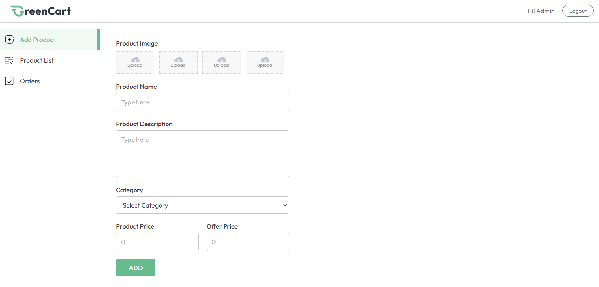
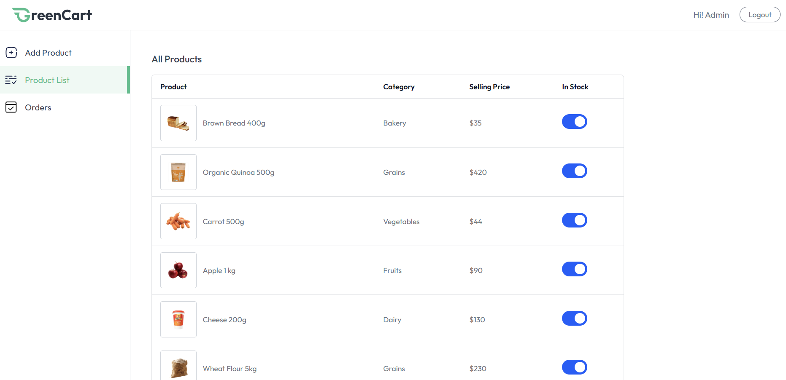

# 🛒 GreenCart – MERN Grocery Delivery Web App  

**Live Frontend Demo:** https://green-cart-rust.vercel.app/  
**Live Backend API:** https://greencart-main.onrender.com  


## 📸 App Showcase  

### 🏠 Home Page  


### 🛍️ Product Listing  


### 🛒 Cart & Checkout  


### 🏪 Seller Dashboard – Add Item  


### 📦 Seller Dashboard – Product List  


## 📌 Overview  

GreenCart is a full-stack MERN grocery delivery web application with complete e-commerce functionality. Users can browse categories, view products, manage their cart, add delivery addresses, choose payment methods (Cash on Delivery or Stripe Online Payment), and place orders securely. The Seller Dashboard allows product uploads, stock control, and order management.

---

## ✨ Features  

### 👤 User Features  
- Account creation & login (JWT authentication)  
- Fully responsive UI with Tailwind CSS  
- Browse grocery categories & all products  
- Product details with image gallery  
- Related product suggestions  
- Add to cart, quantity update, remove items  
- Add & select delivery address  
- Stripe Online Payment + Cash on Delivery  
- Order history (ID, amount, items, payment type)  
- Profile dropdown (My Orders, Logout)  
- Real-time toast notifications  

### 🏪 Seller Dashboard (`/seller`)  
- Seller login  
- Add products (image, category, description, price, offer price)  
- Product list with stock toggle  
- Manage customer orders  
- View shipping address, payment method, date & amount  

### 🔧 Additional Highlights  
- Vite + React for blazing-fast performance  
- Context API for global state  
- Tailwind + Preline UI  
- Mobile-friendly UI  
- Google Font: Outfit  
- Category-based dynamic routing  
- Reusable Product Card component  
- Smooth hover animations & transitions  

---

## 🛠️ Tech Stack  

### **Frontend**  
- React.js (Vite)  
- React Router DOM  
- Tailwind CSS  
- Preline UI  
- React Hot Toast  
- Context API  
- Google Fonts  

### **Backend**  
- Node.js  
- Express.js  
- MongoDB & Mongoose  
- JWT Authentication  
- Bcrypt  
- Multer (Image Upload)  
- Stripe Payment  
- Dotenv  

---

## 📁 Project Structure  

```bash
greencart/
│  
├── client/
│   ├── src/
│   │   ├── assets/
│   │   ├── components/
│   │   ├── context/
│   │   ├── pages/
│   │   ├── App.jsx
│   │   └── main.jsx
│   ├── index.html
│   └── package.json
│  
└── server/
    ├── models/
    ├── routes/
    ├── controllers/
    ├── middleware/
    ├── config/
    ├── server.js
    └── package.json
```
## ⚙️ Setup Instructions (Local Development)

### 1️⃣ Clone the Repo
```bash
git clone https://github.com/mrsarthakgupta/greencart.git
cd greencart
```

### 2️⃣ Install Dependencies

```bash
cd server && npm install
cd ../client && npm install
```

### 3️⃣ Run the Development Servers
Backend
```
cd server
npm run dev
```

Frontend
```
cd client
npm run dev
```


## 🔐 Environment Variables
### server/.env
```
PORT=4000
NODE_ENV=production
FRONTEND_URL=http://localhost:5173

JWT_SECRET=your_jwt_secret_here

SELLER_EMAIL=your_seller_email_here
SELLER_PASSWORD=your_seller_password_here

MONGODB_URI=your_mongo_uri_here

CLOUDINARY_CLOUD_NAME=your_cloudinary_name
CLOUDINARY_API_KEY=your_cloudinary_api_key
CLOUDINARY_API_SECRET=your_cloudinary_api_secret

STRIPE_PUBLISHABLE_KEY=pk_test_123
STRIPE_SECRET_KEY=sk_test_123
STRIPE_WEBHOOK_SECRET=whsec_123
```
### client/.env
```
VITE_CURRENCY=$
VITE_BACKEND_URL=http://localhost:4000
```
---
## 🔌 API Endpoints
| Method | Endpoint | Description |
|--------|----------|-------------|
| **POST** | `/api/auth/register` | Register a new user |
| **POST** | `/api/auth/login` | Login user & return JWT token |
| **GET**  | `/api/products` | Get all products |
| **GET**  | `/api/products/:id` | Get product details by ID |
| **POST** | `/api/orders` | Create a new order |
| **GET**  | `/api/orders/:userId` | Get all orders of a specific user |
| **POST** | `/api/stripe/create-payment-intent` | Create Stripe payment intent |
| **POST** | `/api/seller/products` | Add a new product (Seller-only) |
| **GET**  | `/api/seller/orders` | Get all customer orders (Seller-only) |

---
## 🚀 Future Improvements
 - Add unit tests (Jest + RTL + Supertest)
 - Docker + Docker Compose support
 - Add Stripe webhooks for order verification
 - Add role-based admin panel
 - Email notifications after order placement
 - Add server-side pagination + search
 - Move images to Cloudinary or S3

## 👤 Developer
Sarthak Gupta
📧 sarthakgupta007brh@gmail.com

## ❤️ Final Note
GreenCart is built with speed, usability, and real-world functionality in mind.
Perfect for portfolio, internship applications, and scaling into a full product.
