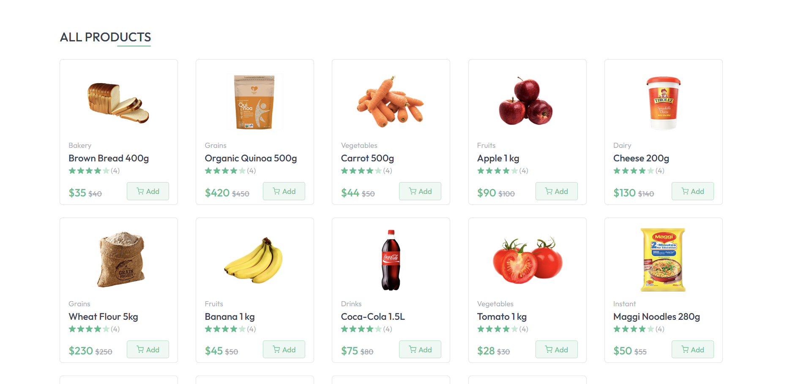
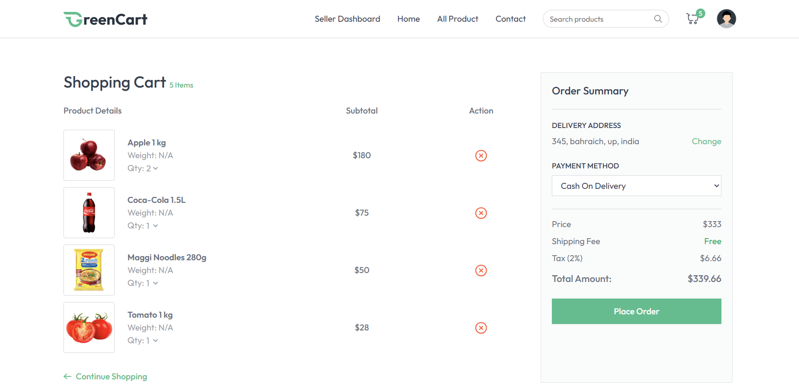

# 🛒 GreenCart – MERN Grocery Delivery Web App  

**Live Frontend Demo:** https://green-cart-rust.vercel.app/  
**Live Backend API:** https://greencart-main.onrender.com  

---

## 📸 Screenshots  

> 📂 Add your screenshots inside a folder named `screenshots/` and update the file names.

  
  
  
  

---

## 📌 Overview  

GreenCart is a full-stack MERN grocery delivery web application with complete e-commerce functionality. Users can browse categories, view products, manage their cart, add delivery addresses, choose payment methods (Cash on Delivery or Stripe Online Payment), and place orders securely. The Seller Dashboard allows product uploads, stock control, and order management.

---

## ✨ Features  

### 👤 User Features  
- Account creation & login (JWT authentication)  
- Fully responsive UI with Tailwind CSS  
- Browse grocery categories & all products  
- Product details with image gallery  
- Related product suggestions  
- Add to cart, quantity update, remove items  
- Add & select delivery address  
- Stripe Online Payment + Cash on Delivery  
- Order history (ID, amount, items, payment type)  
- Profile dropdown (My Orders, Logout)  
- Real-time toast notifications  

### 🏪 Seller Dashboard (`/seller`)  
- Seller login  
- Add products (image, category, description, price, offer price)  
- Product list with stock toggle  
- Manage customer orders  
- View shipping address, payment method, date & amount  

### 🔧 Additional Highlights  
- Vite + React for blazing-fast performance  
- Context API for global state  
- Tailwind + Preline UI  
- Mobile-friendly UI  
- Google Font: Outfit  
- Category-based dynamic routing  
- Reusable Product Card component  
- Smooth hover animations & transitions  

---

## 🛠️ Tech Stack  

### **Frontend**  
- React.js (Vite)  
- React Router DOM  
- Tailwind CSS  
- Preline UI  
- React Hot Toast  
- Context API  
- Google Fonts  

### **Backend**  
- Node.js  
- Express.js  
- MongoDB & Mongoose  
- JWT Authentication  
- Bcrypt  
- Multer (Image Upload)  
- Stripe Payment  
- Dotenv  

---

## 📁 Project Structure  

```bash
greencart/
│  
├── client/
│   ├── src/
│   │   ├── assets/
│   │   ├── components/
│   │   ├── context/
│   │   ├── pages/
│   │   ├── App.jsx
│   │   └── main.jsx
│   ├── index.html
│   └── package.json
│  
└── server/
    ├── models/
    ├── routes/
    ├── controllers/
    ├── middleware/
    ├── config/
    ├── server.js
    └── package.json
